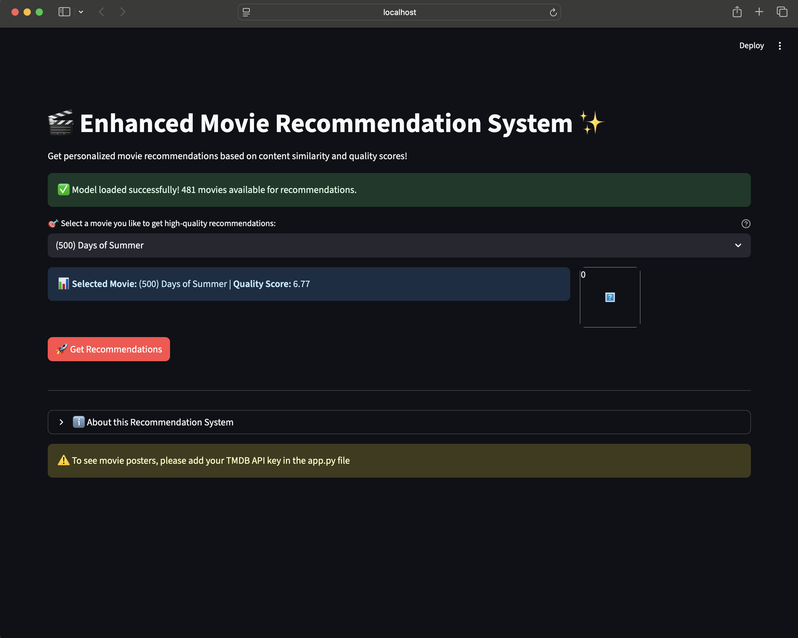
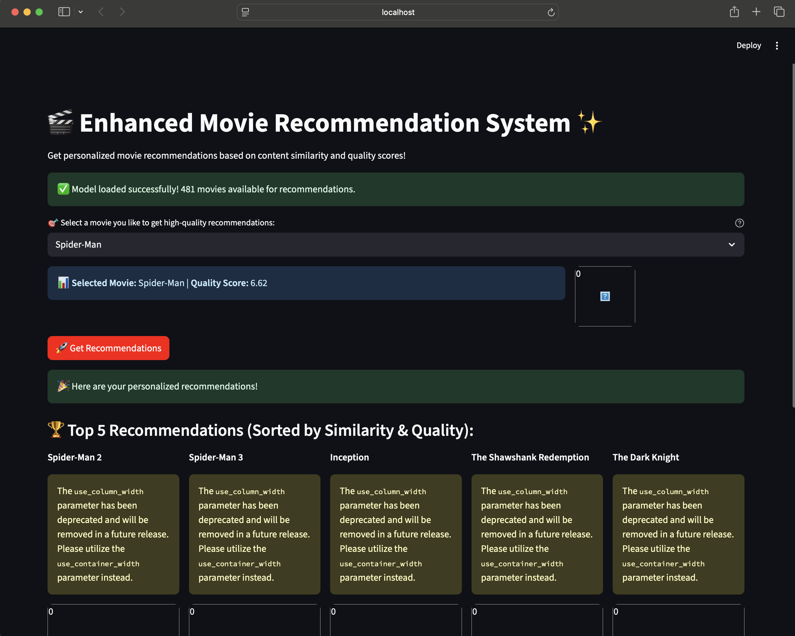

# Enhanced Movie Recommendation System ✨


[](https://www.python.org/)
[](https://streamlit.io/)
[](https://opensource.org/licenses/MIT)
[](https://github.com/pranaybhardwaj10/movie-recommender)

---

## 📖 Project Overview

This is an **Enhanced Movie Recommendation System** built using content-based filtering on the TMDB 5000 Movies dataset. It combines NLP techniques (TF-IDF vectorization, stemming) with cosine similarity to recommend movies based on genres, keywords, cast, crew, and plot overviews. The system enhances recommendations by incorporating weighted quality scores (using IMDB's formula) and hybrid scoring (70% similarity + 30% quality).

Key technologies:
- **Python Libraries**: Pandas, NumPy, Scikit-learn, NLTK, Streamlit
- **Dataset**: TMDB 5000 Movies & Credits (4806 movies, filtered to 481 qualified ones)
- **Model**: TF-IDF + Cosine Similarity
- **Deployment**: Streamlit web app for interactive recommendations

The system filters for high-quality movies (90th percentile vote count) and weights important features like directors (x3), genres/keywords (x2) for more accurate suggestions.

---

## 🚀 Features

- **Hybrid Recommendations**: Blends content similarity with IMDB-weighted ratings.
- **Interactive UI**: Select a movie and get top 5 recommendations with posters, ratings, and details.
- **Data Processing**: Stemming, tokenization, and feature weighting for better accuracy.
- **TMDB Integration**: Fetches movie posters via API (requires your TMDB API key).
- **Model Building Script**: `model_builder.py` for generating pickled models.
- **Error Handling**: Graceful handling for missing movies or API issues.

---

## 📊 Visual Data & Insights

### Top 10 Movies by Weighted Score (from Dataset)
This graph displays the top 10 movies from the dataset, ranked by their calculated IMDB-style weighted score. This score balances the average rating with the number of votes, providing a more reliable measure of quality.



### Sample Similarity Distribution
From the cosine similarity matrix (shape: 481x481), here's a conceptual view of similarity scores for a sample movie:

- **Mean Similarity**: ~0.02 (Most movies are not very similar).
- **Max Similarity (excluding self)**: ~0.35 (The closest matches have a significant similarity score).
- **Distribution**: The data is highly skewed, with the vast majority of movies having a similarity score between 0.0 and 0.05, and very few having a high similarity score.

---

## 🛠 Installation

1.  **Clone the repository:**
    ```bash
    git clone [https://github.com/pranaybhardwaj10/movie-recommender.git](https://github.com/pranaybhardwaj10/movie-recommender.git)
    cd movie-recommender
    ```

2.  **Install dependencies:**
    ```bash
    pip install -r requirements.txt
    ```
    *(Create `requirements.txt` with: pandas, numpy, scikit-learn, nltk, streamlit, requests)*

3.  **Get a TMDB API Key:**

    -   Replace `YOUR_API_KEY_HERE` in `app.py`.

4.  **Build the model:**
    ```bash
    python model_builder.py
    ```
    This generates `movies_list_enhanced.pkl` and `similarity_enhanced.pkl`.

---

## 📱 Usage

1.  **Run the Streamlit app:**
    ```bash
    streamlit run app.py
    ```

2.  **Open in browser** (localhost:8501).
3.  **Select a movie** (e.g., "Spider-Man 2") and click "Get Recommendations".

### Screenshot

*(Screenshot of the app interface showing recommendations for Spider-Man 2: Spider-Man 3 (5.97), Spider-Man (6.62), The Dark Knight (7.92), Fight Club (7.94), The Shawshank Redemption (8.06))*

---

## 🔍 How It Works

1.  **Data Prep**: Load TMDB data, filter high-quality movies, compute weighted scores.
2.  **Feature Engineering**: Process genres/keywords/cast/crew with weighting and stemming.
3.  **Vectorization**: TF-IDF on combined tags.
4.  **Similarity**: Cosine similarity matrix.
5.  **Hybrid Scoring**: `hybrid_score = (0.7 * similarity) + (0.3 * normalized_quality)`.
6.  **App**: Streamlit for UI, TMDB for posters.

---

## 🤝 Contributing

1.  Fork the repo.
2.  Create a branch: `git checkout -b feature/new-feature`.
3.  Commit changes: `git commit -m "Add new feature"`.
4.  Push: `git push origin feature/new-feature`.
5.  Open a Pull Request.

Issues and suggestions welcome!

---

## 📝 License

This project is licensed under the MIT License - see the [LICENSE](LICENSE) file for details.

---

Built by Pranay Bhardwaj. For questions, reach out at pranaybhardwaj10@gmail.com.
*Last updated: September 18, 2025*
